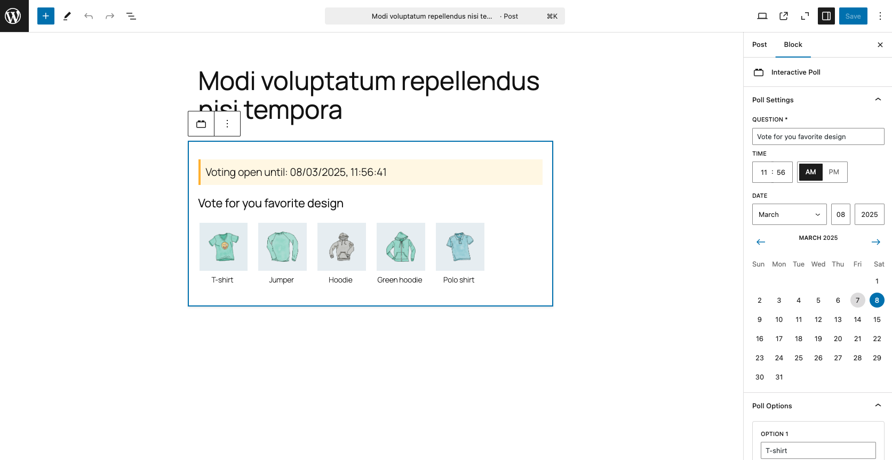
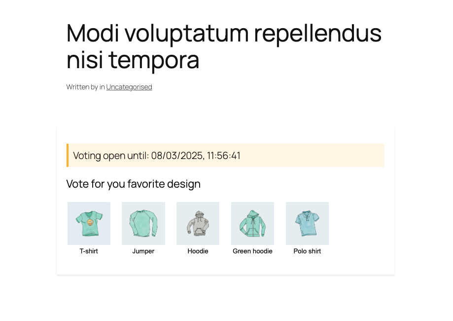

# Interactive Poll Block Plugin

A Gutenberg block plugin for creating interactive polls with images and expiration dates.

## Features
- Create polls with question and maximum 5 options
- Add images from media library
- Set expiration dates
- Vote tracking with cookies
- Real-time results display
- Responsive design

## Installation

1. Download the latest ZIP file from GitHub releases
2. Go to WordPress Admin → Plugins → Add New
3. Click "Upload Plugin" and select the ZIP file
4. Activate the plugin
5. Start using the "Interactive Poll" block in post/page editor

## Development Setup

1. Clone repository:
   git clone https://github.com/janarthanmano/interactive-poll.git

2. Install dependencies:
   cd interactive-poll
   npm install

3. Build plugin:
   npm run build

4. Activate plugin in WordPress

## Screenshots

| Editor View                                 |
|---------------------------------------------|
|   |

| Frontend Voting | Results Display                            |
|-----------------|--------------------------------------------|
|  |  |

## Configuration

Required:
- Poll question
- Minimum 2 options (text or image or both)

Optional:
- Expiration date/time
- Custom images for options
